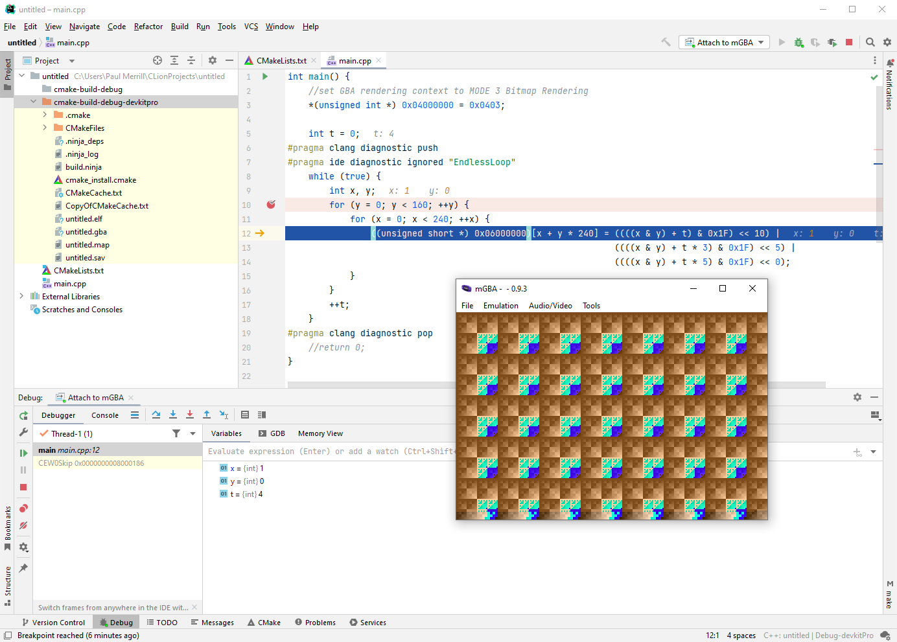

## Playground for a Gameboy Advance app

To build, install [devkitPro](https://devkitpro.org/wiki/Getting_Started) and
get its gba-dev package, and set `$DEVKITPRO` to the install root. This should
be sufficient to get a CMake build going, which will produce a `.gba` file.

To debug, launch [mGBA](https://mgba.io/) with the `-g` flag,  as in `mgba -g
build/untitled.gba`, which will cause it to start a GDB server and wait for a
connection.  Connect to it with:

```
$ gdb build/untitled.elf
(gdb) target remote localhost:2345
```

Some IDEs, like CLion and Visual Studio Code, support remote GDB debugging and
will provide a nice UI while doing so.

To view runtime print statements, go to Tools -> Logs in the mGBA menu bar.


